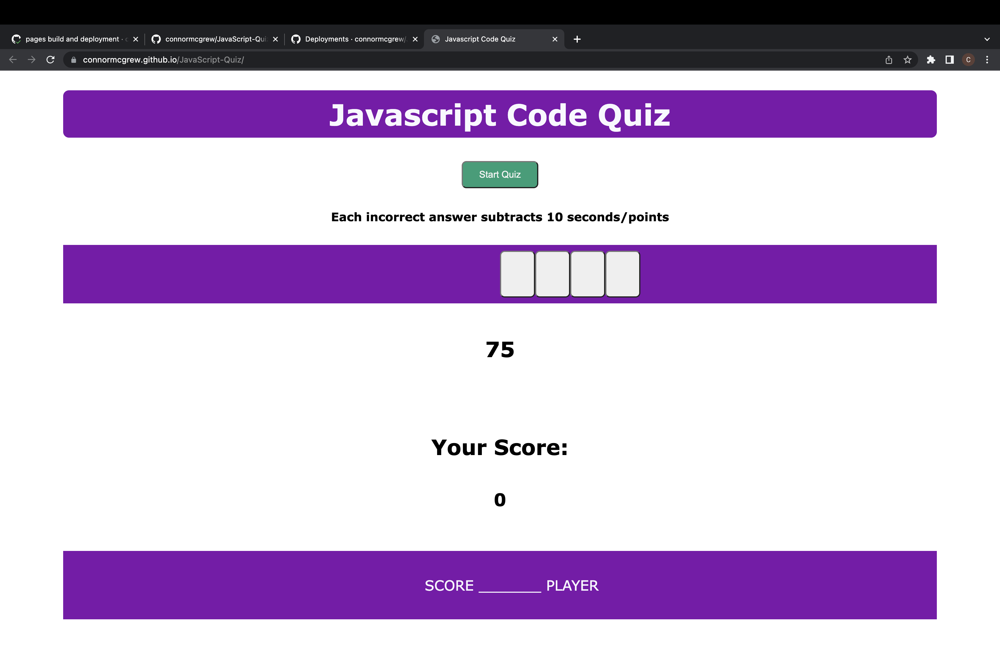

# JavaScript Quiz 
  
  ## Table of Contents
  * [Description](#description)
  * [Installation](#installation)
  * [Usage](#usage)
  * [Licenses](#licenses)
  * [Questions](#questions)

  ## Description 
    This is a quiz on javascript, once you click the "Start Quiz" button you will have 75 seconds to answer 10 questions on javascript. If you get a question wrong, 10 seconds is subtracted from your time. Once the quiz is over you will be prompted to saved your initials, then they will be put on the leader board next to your score.
  

## Installation 
N/A
## Usage 
This is a webpage, to use follow the pages link
## Licenses 
  ## Licenses
    This project is covered under the MIT license. To learn more about what this means, click the license button at the top.
## Questions 
Any questions about the project?
Github: https://github.com/connormcgrew
Email: connormcgrew003@gmail.com
